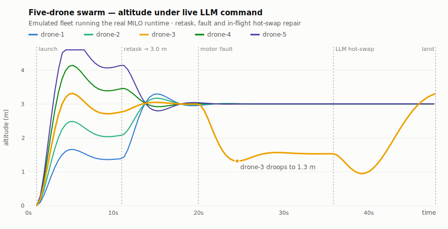
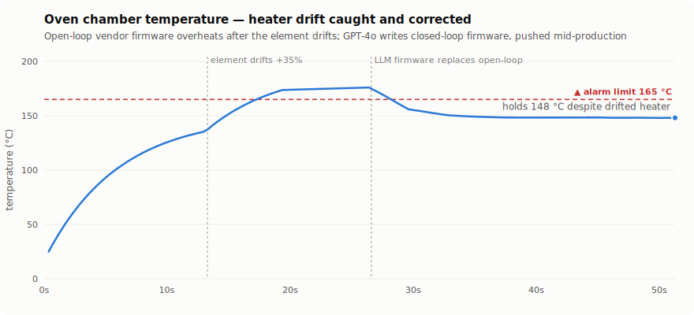
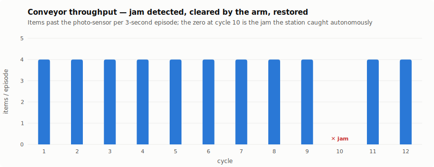

# MILO — Evidence Pack

Raw material for a blog post: everything below was measured on a real run,
reproducible with two commands. Written 2026-07-05.

## What was run, honestly stated

Both scenarios run on a **virtual fleet**: each "device" is a separate
`milo-receiver` process — the **same Rust runtime that ships to ESP32-C3 and
Raspberry Pi Pico hardware** (same wasmi interpreter, same 12-syscall ABI, same
MILO-Link framing, same import validation, same fuel metering) — with the
peripheral layer replaced by small continuous-time physics models (motor thrust,
thermal response, belt motion). The LLM calls are **live GPT-4o**, using the same
system prompt as the interactive CLI; the generated firmware source is preserved
verbatim in `demos/evidence/`. No hardware was harmed or, indeed, available.

What emulation does *not* validate: real-world sensor noise, USB/radio link
flakiness, timing jitter on a 160 MHz MCU. What it does validate: the entire
software stack from natural language to executing sandboxed machine code on a
fleet, with the physics reacting.

Reproduce:

```bash
cd receiver && cargo build && cd ..
python3 demos/swarm_demo.py      # scenario 1 (~50 s)
python3 demos/factory_demo.py    # scenario 2 (~55 s)
python3 demos/charts.py          # regenerate the SVGs
```

Without `OPENAI_API_KEY` the scenarios still run end-to-end using scripted
fallback drivers and say so in the transcript.

## Scenario 1 — a laptop flies a five-drone swarm

One host process compiled **one 943-byte wasm flight controller in 571 ms** and
pushed it to five emulated quadcopters **in parallel in under 1 ms**. Each drone
read its own altitude target from a live parameter slot — the same binary flew
the whole echelon (1.4 m → 4.2 m).

| Event | Measurement |
|---|---|
| Flight controller size / compile | 943 bytes / 571 ms |
| Parallel push to 5 drones | < 1 ms (localhost TCP) |
| **Mid-flight formation retask** (5 drones → 3.0 m) | **0.05 ms broadcast**, no recompile, no reflash |
| Injected fault (motor 2 at 40% thrust) | drone-3 droops **1.89 m** below target |
| GPT-4o writes the repair (PI controller) | **6.9 s**, 975 bytes, compiled first try |
| In-flight hot-swap of the running controller | 0.05 ms send; **altitude recovered in 9.5 s** |
| Coordinated landing (cooperative-stop broadcast) | all 5 drones report `ok`, motors safed |



Key narrative beats, all visible in the chart:

1. **One binary, five behaviors** — the controller reads `get_param(0)` every
   50 ms, so the echelon is data, not code.
2. **The retask is a parameter broadcast** — five drones change altitude
   simultaneously for the cost of five 8-byte frames.
3. **The failure is a control-theory failure** — a pure-P controller under a
   thrust deficit doesn't crash, it *droops*. Exactly what the physics predicts.
4. **The fix is new firmware written by the LLM mid-flight** — GPT-4o's PI
   controller (see `demos/evidence/swarm_llm_driver.rs`, logs "Altitude
   controller engaged") was hot-swapped onto the running drone; the wasm
   sandbox + import whitelist checked it before a single instruction ran.

## Scenario 2 — an LLM-supervised factory cell

Three machines (conveyor, reflow oven, pick arm) under one autonomous control
station. Two unannounced incidents, both handled without a human.

| Event | Measurement |
|---|---|
| Steady state | 4 items/cycle throughput; oven ramping to 150 °C set-point |
| **Incident A**: heater element drifts +35% (cycle 5) | oven peaks **175.9 °C** vs 165 °C alarm limit |
| GPT-4o diagnosis + **replacement closed-loop firmware** | diagnosis in 2.0 s; firmware 835 bytes in 4.7 s |
| After the swap | oven back inside limits within 1 cycle; **holds 148 °C for the rest of the shift despite the drifted heater** |
| **Incident B**: item jams the belt (cycle 10) | detected same cycle: belt powered, 0 items counted |
| Autonomous recovery: halt belt → arm clear-sweep → resume | **4.1 s**, arm limit switches confirm the sweep |
| Shift totals | 44 items; throughput after recovery identical to healthy baseline (4.0/cycle) |





The part worth writing about: the oven's "vendor firmware" was deliberately
open-loop — a fixed heater duty, calibrated for a healthy element. When the
element drifted, the *right* fix wasn't a new set-point, it was a **new control
law**. The supervisor's GPT-4o call returned integral-control firmware
(preserved in `demos/evidence/factory_llm_oven_fix.rs`), the station pushed it
between production cycles, and the plant held its set-point on hardware whose
characteristics had changed. That is "the LLM edits the firmware in realtime to
adapt" — demonstrated, measured, and logged.

GPT-4o's live jam diagnosis (verbatim, `demos/evidence/factory_llm_jam_diagnosis.txt`):

> The telemetry indicates that the conveyor belt motor is operating at the
> commanded duty cycle, but no items were counted by the photo-sensor in the
> latest cycle, suggesting a physical jam on the conveyor belt. […] ACTION:
> halt_and_clear

## Why this is architecturally interesting

- **Live control of running firmware** came from the `MiloExecutor` abstraction:
  the new `ThreadedExecutor` runs wasm off the main loop, so devices answer
  stop/status/set-param/hot-swap *during* execution — the same contract the
  RP2040's dual-core executor provides on silicon.
- **Safety is structural, not aspirational**: every module (including GPT-4o's)
  passes an import whitelist before instantiation, runs inside a 64 KB wasm
  sandbox, and is fuel-metered. A hostile or buggy driver can waste its own
  episode, not the device.
- **The protocol is 5 bytes of header.** Everything above — discovery,
  telemetry, retasking, hot-swap — is nine opcodes over any byte stream. The
  same frames work over USB serial to a $4 Pico.

## Evidence index

| File | What it is |
|---|---|
| `demos/evidence/swarm_transcript.txt` | timestamped host-side transcript, scenario 1 |
| `demos/evidence/swarm_telemetry.jsonl` | 20 Hz physics ground truth, 5 drones |
| `demos/evidence/swarm_events.json` | event timeline + all metrics above |
| `demos/evidence/swarm_llm_driver.rs` | the GPT-4o-written repair controller, verbatim |
| `demos/evidence/factory_transcript.txt` | timestamped transcript, scenario 2 |
| `demos/evidence/factory_telemetry.jsonl` | physics ground truth, 3 machines |
| `demos/evidence/factory_events.json` | cycle readings + incident timeline + metrics |
| `demos/evidence/factory_llm_oven_fix.rs` | the GPT-4o-written oven firmware, verbatim |
| `demos/evidence/factory_llm_diagnosis.txt` / `_jam_diagnosis.txt` | GPT-4o's live diagnoses |
| `docs/blog/assets/*.svg` | the three charts (theme-aware, from telemetry) |
