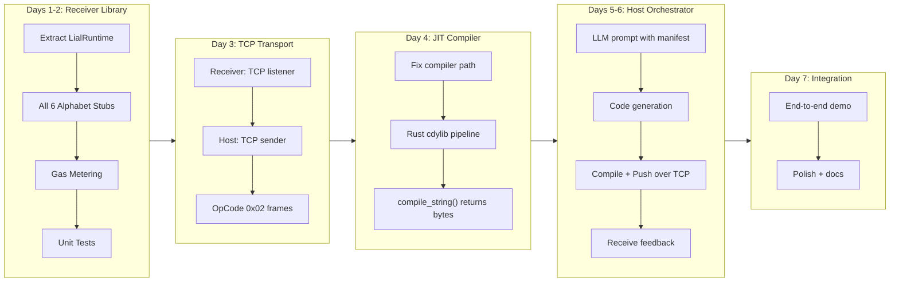

# Week 1 Action Plan: Prompt to Silicon

**Goal:** Go from a working but monolithic receiver (2/6 syscalls, mock blink) to a full "User Prompt -> LLM -> Compile -> TCP Push -> Receiver Executes -> Feedback" loop running entirely on a laptop.

## What's Done (Pre-Week-1)

- Architecture and spec fully defined in `.cursor/project.md`
- Receiver compiles and runs, executing a 600-byte mock wasm blink driver
- 2 of 6 Alphabet syscalls implemented (`lial_gpio_set`, `lial_delay_ms`)
- `lial_compiler.py` exists (C string -> wasm via Clang) but WASI-SDK path is a placeholder
- `lial-link/` directory is empty
- `lial_std.rs` is dead code (uses `embedded_hal`, not wired in)
- Receiver is a monolithic `main()` -- not testable as a library

## Roadmap



---

## Days 1-2: Receiver as a Testable Library

The receiver is currently a single `main()` in `lial-receiver/src/main.rs`. Refactor into a library so the runtime can be used from `main.rs`, from tests, and later from TCP-driven execution.

**Create `lial-receiver/src/lib.rs`:**

- `LialRuntime` struct owning `Engine`, `Store`, `Linker`
- `LialRuntime::new(fuel: Option<u64>)` -- sets up engine with optional gas budget
- `LialRuntime::load_module(&mut self, wasm_bytes: &[u8])` -- validates and loads a module
- `LialRuntime::execute(&mut self, export_name: &str)` -- instantiates, links, and calls the export
- `LialError` enum: `ModuleLoadFailed`, `MissingExport`, `FuelExhausted`, `ExecutionTrapped`, etc.

**Implement all 6 Alphabet stubs (laptop mock mode):**

| Function | Laptop Behavior |
|----------|----------------|
| `lial_gpio_set(pin, state)` | Print `[GPIO] pin -> state` |
| `lial_gpio_get(pin)` | Return 0, print `[GPIO] read pin` |
| `lial_delay_ms(ms)` | `thread::sleep` |
| `lial_get_uptime_us()` | `Instant::now().elapsed()` from a stored start time |
| `lial_i2c_transfer(...)` | Print log, return 0 (success) |
| `lial_log(msg)` | Read string from wasm memory, print it |

`lial_log` is the tricky one -- it requires reading a C string from wasm linear memory. The `Store` needs to hold a reference to the module's memory export, so the store data type changes from `()` to a struct holding state (start instant, memory ref).

**Add gas metering:**

- `wasmi` supports fuel via `Store::set_fuel()` and `Store::get_fuel()`
- Default budget: configurable, e.g. 1,000,000 units
- Test: a wasm module with an infinite loop hits `FuelExhausted`

**Slim down `main.rs`** to just: parse CLI args (wasm path), create `LialRuntime`, load, execute.

**Remove or gate `lial_std.rs`** -- it's dead code with an unresolvable `embedded_hal` dependency. Remove it for now; the real embedded HAL dispatch will be added when targeting hardware.

**Tests (in `lial-receiver/tests/`):**

- Happy path: mock_driver blink runs, returns Ok
- Missing export: load valid wasm, call nonexistent function -> `MissingExport`
- Gas exhaustion: load infinite-loop wasm -> `FuelExhausted`
- Bad module: load random bytes -> `ModuleLoadFailed`

---

## Day 3: TCP Transport (LIAL-Link v0.1)

Implement a minimal LIAL-Link over TCP in `lial-link/`. This can be a shared Rust crate used by both receiver and a future Rust host shim, or just a simple protocol definition.

**Protocol (CBOR over TCP):**

- Frame: `[opcode: u8, payload_len: u32, payload: bytes]`
- OpCode `0x01`: Discovery -- Receiver sends its Hardware Manifest (JSON)
- OpCode `0x02`: BytecodePush -- Host sends `.wasm` bytes
- OpCode `0x03`: ExecResult -- Receiver sends execution log/result back

**Receiver side (`lial-receiver/src/main.rs`):**

- Listen on `127.0.0.1:9100`
- On connect: send `0x01` with a hardcoded mock manifest
- Wait for `0x02`, extract wasm bytes, pass to `LialRuntime::load_module()` + `execute("run_logic")`
- Send `0x03` with execution result (success/error + captured logs)

No `cbor` crate needed yet -- for the TCP POC, a simple length-prefixed binary frame is sufficient. CBOR can be added later for the payload encoding.

---

## Day 4: JIT Compiler Fix

The existing `lial-host/lial_compiler.py` compiles C strings to wasm via Clang, but the WASI-SDK path is a placeholder and WASI-SDK is not installed.

**Two options (pick based on what's simpler):**

- **Option A: Use system `clang`** -- Apple Clang supports `--target=wasm32` with `-nostdlib`. Modify `LIALCompiler` to use `/usr/bin/clang` directly with the existing flags. No WASI-SDK needed since LIAL drivers don't use libc.
- **Option B: Rust cdylib pipeline** -- Add a `compile_rust_string()` method that writes a temp `.rs` file, calls `rustc --target wasm32-unknown-unknown --crate-type cdylib -O`, and returns the bytes. This matches the existing mock_driver approach.

Both should work. Option A is fewer dependencies; Option B matches the Rust ecosystem better.

**Also add:** `compile_string() -> bytes` variant that returns the `.wasm` bytes directly instead of writing to a file (needed for TCP push).

---

## Days 5-6: Host Orchestrator + LLM Integration

Build `lial-host/lial_host.py` -- the main orchestrator script.

**Components:**

1. **TCP Client** -- Connect to Receiver at `127.0.0.1:9100`, receive manifest (`0x01`), send bytecode (`0x02`), receive result (`0x03`).
2. **LLM Prompter** -- Takes user input + hardware manifest, constructs a prompt asking the LLM to generate a C function using the LIAL Alphabet. Uses `openai` or `anthropic` SDK.
3. **Pipeline** -- `user_prompt` -> `llm_generate(prompt, manifest)` -> `compiler.compile_string(code)` -> `tcp_push(wasm_bytes)` -> `print(result)`

**The LLM prompt template** should include:

- The Alphabet function signatures (from `lial_std.h`)
- The hardware manifest (received from the device)
- The constraint: "Write a single C function called `run_logic()` that uses only these functions. No includes. No main()."

**Minimal CLI:**

```
$ python lial_host.py
Connected to LIAL Receiver at 127.0.0.1:9100
Device Manifest: {"pins": [5], "buses": ["i2c0"]}

> Blink pin 5 three times with 200ms intervals

Generating code via LLM...
Compiling to WebAssembly...
Pushing 412 bytes to device...
Execution result: OK
[GPIO] 5 -> ON
[TIMER] 200ms
[GPIO] 5 -> OFF
...
```

---

## Day 7: Integration + Polish

- Run the full loop end-to-end: start receiver in one terminal, host in another, type a prompt, watch it execute.
- Handle error cases: LLM generates bad code -> compilation fails -> report to user.
- Update `docs/week1/changelog.md`, `docs/week1/currentStatus.md`, and `README.md`.

---

## Files to Create/Modify

| File | Action |
|------|--------|
| `lial-receiver/src/lib.rs` | **Create** -- `LialRuntime`, all 6 stubs, gas metering, error types |
| `lial-receiver/src/main.rs` | **Rewrite** -- thin wrapper using `LialRuntime`, TCP listener |
| `lial-receiver/src/lial_std.rs` | **Remove** -- dead code, `embedded_hal` not available |
| `lial-receiver/Cargo.toml` | **Update** -- add `serde_json` (manifest), remove `embedded_hal` concern |
| `lial-receiver/tests/` | **Create** -- integration tests |
| `lial-host/lial_compiler.py` | **Update** -- fix clang path, add `compile_to_bytes()` |
| `lial-host/lial_host.py` | **Create** -- orchestrator with TCP client + LLM prompt |
| `lial-host/requirements.txt` | **Create** -- `openai` or `anthropic`, `cbor2` (optional) |
| `docs/changelog.md` | **Update** -- new entries |
