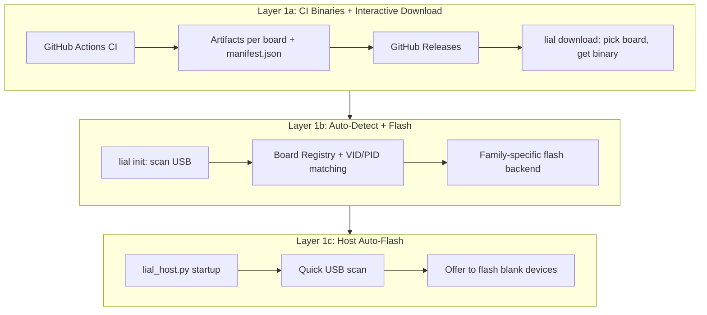

# Week 2 Plan: Firmware Delivery + Hardware Universality + Smart Manifests

**Goal:** Make LIAL installable on any supported board without a Rust toolchain, support multiple board families from a single codebase, and give the LLM rich hardware knowledge.

## Where We Are (Week 1 -- Done)

The core loop is proven on real hardware:

```
Natural language -> GPT-4o -> Rust -> wasm (618 bytes) -> USB serial -> ESP32-C3 wasmi -> GPIO blinks -> JSON result
```

What exists: 1 board (ESP32-C3), 1 transport (USB serial), 6 syscalls (GPIO, delay, uptime, I2C stub, log), 1 LLM (GPT-4o), a JIT compiler, gas metering, and 4 integration tests.

---

## Layer 1: Receiver Firmware Delivery

**Problem:** Getting LIAL onto a device requires Rust nightly, the `patches/` directory, a multi-flag cargo build, and manual flashing. This is a developer workflow, not a product.

**Three sub-layers, each progressively lowering the barrier:**



### Layer 1a: Pre-built Binaries via CI + Interactive Download

**CI Build Matrix:**
- GitHub Actions workflow (`.github/workflows/build-receiver.yml`) builds one artifact per supported board variant on every release tag
- Output naming: `lial-receiver-<variant>-<version>.<ext>` (e.g. `lial-receiver-esp32c3-v0.3.0.bin`, `lial-receiver-rp2040-v0.3.0.uf2`)
- Publishes a `manifest.json` alongside binaries listing every available variant with metadata:

```json
{
  "version": "0.3.0",
  "boards": [
    {
      "variant": "esp32c3",
      "family": "esp32",
      "display_name": "ESP32-C3 (RISC-V)",
      "filename": "lial-receiver-esp32c3-v0.3.0.bin",
      "flash_tool": "esptool",
      "size_bytes": 287440
    },
    {
      "variant": "rp2040",
      "family": "rp2040",
      "display_name": "Raspberry Pi Pico (RP2040)",
      "filename": "lial-receiver-rp2040-v0.3.0.uf2",
      "flash_tool": "picotool / drag-and-drop",
      "size_bytes": 195200
    },
    {
      "variant": "stm32f411",
      "family": "stm32",
      "display_name": "STM32F411 (Black Pill)",
      "filename": "lial-receiver-stm32f411-v0.3.0.bin",
      "flash_tool": "stm32loader / dfu-util",
      "size_bytes": 210000
    }
  ]
}
```

**Interactive Download CLI (`lial download`):**
- Fetches `manifest.json` from latest GitHub Release
- Presents numbered list of all available board variants with human-readable names, sizes, and file types
- User picks their board, binary is downloaded, board-specific flash instructions are printed
- `--board <variant>` flag for non-interactive/scripted use
- No external dependencies beyond `urllib` (stdlib)

### Layer 1b: Proactive Device Discovery + Auto-Flash (`lial init`)

**Board Registry (`board_registry.py`):** A data table mapping USB VID/PID pairs to board families. Adding a new board is adding a row, not writing code.

```python
BOARD_REGISTRY = [
    {"family": "esp32",  "vid_pid": [(0x303A, 0x1001), ...], "probe": "esptool",  "flash_backend": "esptool",     "firmware_ext": ".bin"},
    {"family": "rp2040", "vid_pid": [(0x2E8A, 0x0003), ...], "probe": "picotool", "flash_backend": "uf2",         "firmware_ext": ".uf2"},
    {"family": "avr",    "vid_pid": [(0x2341, 0x0043), ...], "probe": "avrdude",  "flash_backend": "avrdude",     "firmware_ext": ".hex"},
    {"family": "stm32",  "vid_pid": [(0x0483, 0xDF11)],      "probe": "dfu-util", "flash_backend": "stm32loader", "firmware_ext": ".bin"},
    {"family": "samd",   "vid_pid": [(0x2341, 0x804D), ...], "probe": "bossac",   "flash_backend": "bossac",      "firmware_ext": ".bin"},
]
```

**Flash Backends:** Each board family has a small Python module implementing `probe(port) -> BoardInfo` and `flash(port, firmware_path) -> bool`:
- `esptool` for ESP32 family (Python library)
- `picotool` / filesystem copy for RP2040 (UF2 drag-and-drop)
- `avrdude` / `arduinobootloader` for Arduino AVR
- `stm32loader` / `dfu-util` for STM32
- `bossac` for SAMD

**Detection flow (board-agnostic):**
1. Enumerate USB ports via `serial.tools.list_ports.comports()`
2. Match VID/PID against Board Registry
3. Probe with family-specific backend for exact chip variant
4. Check for LIAL-Link discovery frame (opcode `0x01`) with 2s timeout
5. Classify: "blank (needs flash)", "LIAL vX.Y.Z", or "unknown"

**Escape hatch:** For boards with no USB (bare STM32, industrial controllers), user specifies port and board manually: `lial init --port /dev/ttyUSB0 --board stm32f411`

### Layer 1c: Host Auto-Flash on First Connect

When `lial_host.py` starts, it runs a quick USB scan. If it finds devices without LIAL firmware, it proactively offers to flash them. Zero-knowledge first-time UX: plug in -> `python3 lial_host.py` -> "Flash? Y" -> "Type a task:" -> done.

### The Chicken-and-Egg Constraint

A blank microcontroller has no firmware -- no BLE, no Wi-Fi, no LIAL. First flash is always wired (USB or UART). After that, BLE/Wi-Fi become ongoing management transports for boards with radios (covered in Week 3).

### Pre-built Binary Matrix

| Family | Target | Output | Tool |
|--------|--------|--------|------|
| ESP32-C3 | `riscv32imc-unknown-none-elf` | `.bin` (via `espflash save-image`) | Rust nightly + esp-hal |
| ESP32-S3 | `xtensa-esp32s3-none-elf` | `.bin` | Rust nightly + esp-hal |
| RP2040 | `thumbv6m-none-eabi` | `.uf2` (via `elf2uf2`) | Rust stable + rp-hal |
| Arduino AVR | (TBD - C/Wiring or Rust AVR) | `.hex` | avr-gcc or Rust AVR nightly |
| STM32F4 | `thumbv7em-none-eabihf` | `.bin` | Rust stable + stm32-hal |
| SAMD21 | `thumbv6m-none-eabi` | `.bin` | Rust stable + atsamd-hal |

### New Python Dependencies (Layer 1)

| Package | Purpose | Board families |
|---------|---------|----------------|
| `esptool` | ESP32 chip detection + flash | ESP32 family |
| `arduinobootloader` | AVR CPU signature detection + STK500 flash | Arduino Uno/Mega/Nano |
| `stm32loader` | STM32 UART bootloader flash | STM32 family |
| `pydfuutil` | STM32 USB DFU flash | STM32 (DFU mode) |
| `pyusb` | Raw USB descriptor scanning (for BOOTSEL mode RP2040 etc.) | All |

All pure Python, pip-installable, cross-platform. Flash tool CLIs (`avrdude`, `picotool`, `bossac`) are optional system dependencies -- LIAL reports helpful install instructions if missing.

---

## Layer 2: Hardware Universality

**Problem:** Today, adding a new board means writing a new `impl LialHardware`. The `Esp32C3Hal` is hardcoded to one LED on one pin.

### Generic `embedded-hal` Adapter

Replace board-specific impls with a single generic struct:

```rust
use embedded_hal::digital::{OutputPin, InputPin};
use embedded_hal::delay::DelayNs;
use embedded_hal::i2c::I2c;

pub struct EmbeddedHalAdapter<P, D, I> {
    pins: BTreeMap<u32, P>,
    delay: D,
    i2c: I,
    log_sink: fn(&str),
}

impl<P, D, I> LialHardware for EmbeddedHalAdapter<P, D, I>
where
    P: OutputPin + InputPin,
    D: DelayNs,
    I: I2c,
{
    fn gpio_set(&mut self, pin: u32, state: u32) {
        if let Some(p) = self.pins.get_mut(&pin) {
            if state == 1 { p.set_high().ok(); } else { p.set_low().ok(); }
        }
    }
    // ... etc
}
```

With this, supporting a new board becomes:

```rust
let hw = EmbeddedHalAdapter::new(pins, delay, i2c, uart_log);
let runtime = LialRuntime::new(hw, Some(1_000_000));
```

### Dynamic Pin Mapping

Replace the single hardcoded `led_pin` in `Esp32C3Hal` with a `BTreeMap<u32, Pin>` so wasm can address any pin the device exposes.

### Expand the Alphabet

The current 6 syscalls cover the basics. Real devices need:
- `lial_spi_transfer` -- SPI bus (displays, SD cards, radio modules)
- `lial_pwm_set` -- PWM output (motor control, LED dimming, servos)
- `lial_adc_read` -- Analog input (temperature sensors, potentiometers, light sensors)
- `lial_uart_write` / `lial_uart_read` -- Secondary UART (GPS modules, other serial devices)

Target: ~10-12 syscalls total (under 15).

### Validate on a Second Board

Flash the receiver onto an ESP32-S3 or RP2040 to prove the adapter actually works cross-platform.

### Dependencies

- `embedded-hal = "1.0"` (trait definitions)
- Board HALs that implement `embedded-hal` traits (e.g., `esp-hal`, `stm32-hal`, `rp-hal`)

---

## Layer 3: Smart Discovery and Manifests

**Problem:** The hardware manifest is hardcoded JSON. The LLM gets `"pins": [5]` and has no idea what's actually wired to the board.

### SVD / Device-Tree Parsing

Most microcontrollers ship SVD (System View Description) files listing every peripheral, register, and pin. Write a Python parser that ingests SVD and produces a rich manifest: which pins exist, which are wired to LEDs/buttons/sensors, which buses are available, memory limits.

### Runtime Peripheral Probing

For I2C, the receiver can scan the bus on boot and report which addresses respond. The manifest then says:

```json
{"i2c_devices": [{"addr": "0x48", "likely": "TMP102 temperature sensor"}]}
```

### Rich Manifests for the LLM

Not just `"pins": [5]` but:

```json
{
  "pin_5": {"function": "LED", "color": "blue", "active_high": true},
  "i2c_0x48": {"device": "TMP102", "registers": {"temperature": "0x00", "config": "0x01"}}
}
```

---

## Week 2 Tasks Summary

| Task | Layer | Effort |
|------|-------|--------|
| GitHub Actions CI build matrix + `manifest.json` | 1a | Small |
| Interactive download CLI (`lial download`) | 1a | Small |
| Board Registry + Flash Backends (start with ESP32, add RP2040) | 1b | Medium |
| `lial init` with USB auto-detection | 1b | Medium |
| Host auto-flash on `lial_host.py` startup | 1c | Small |
| Generic `embedded-hal` adapter + dynamic pin mapping | 2 | Medium |
| Expand Alphabet (SPI, PWM, ADC, UART) | 2 | Medium |
| Validate on a second board | 2 | Small |
| Begin SVD parsing + rich manifest generation | 3 | Medium |

---

## What's Deferred to Week 3

- BLE and Wi-Fi device discovery (Layer 1b extension)
- Wi-Fi and BLE transport for LIAL-Link (Layer 4)
- CBOR serialization (Layer 4)
- Multi-device orchestration (Layer 5)
- Feedback loops: streaming, LLM-in-the-loop, hot-swap (Layer 6)
- Safety and production hardening (Layer 7)
- `lial` CLI tool, MCP server, upstream wasmi patches (Layer 8)
