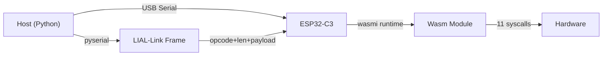
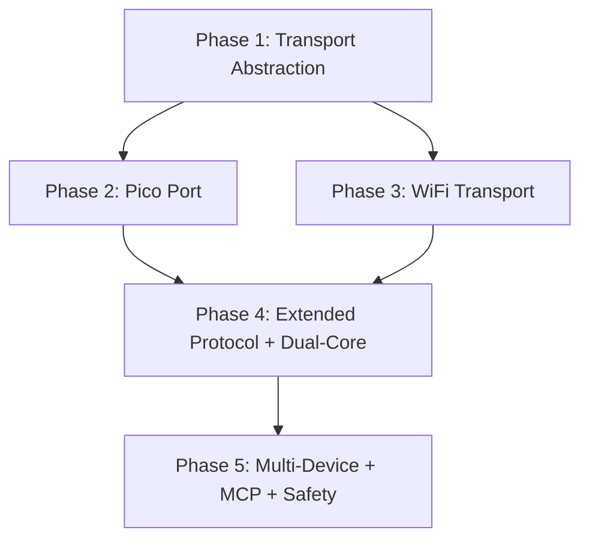

# Week 3 Phased Build Plan

This document is the **repository copy** of the Week 3 phased build specification (5 phases, dependency graph, file and dependency tables). Implementation status vs this plan is tracked in [`../WEEK3_IMPLEMENTATION.md`](../WEEK3_IMPLEMENTATION.md).

## Current Architecture (What Exists)



Key files:
- Receiver main loop: [lial-receiver/src/main.rs](lial-receiver/src/main.rs) (lines 160-206 — ESP32 opcode dispatch)
- Transport framing: [lial-receiver/src/link.rs](lial-receiver/src/link.rs) (std-only `read_frame`/`write_frame`)
- Hardware trait: [lial-receiver/src/lib.rs](lial-receiver/src/lib.rs) (lines 21-54 — `LialHardware`)
- Board HAL: [lial-receiver/src/esp32c3.rs](lial-receiver/src/esp32c3.rs) (`Esp32C3Hal` wraps `EmbeddedHalAdapter`)
- Generic adapter: [lial-receiver/src/embedded_hal_adapter.rs](lial-receiver/src/embedded_hal_adapter.rs)
- Host serial: [lial-host/lial_host.py](lial-host/lial_host.py) (lines 47-77 — `_make_frame`/`_read_frame` over pyserial)

Key observations:
- Transport is hardcoded: ESP uses inline `read_exact`/`write_bytes` on USB-Serial-JTAG; `link.rs` only has `std`-gated helpers
- The main loop owns the HAL, creates a new `LialRuntime` per execution, reclaims HAL via `into_hardware()`
- No `LialTransport` trait exists yet — transport is baked into `Esp32C3Hal` struct
- Pico will need: different target (`thumbv6m-none-eabi`), different HAL crate (`rp2040-hal`), possibly no wasmi patches

---

## Phase 1: Transport Abstraction (Foundation)

**Goal:** Decouple transport from hardware. Create `LialTransport` trait so the main loop is transport-agnostic.

### Receiver Changes

1. **Define `LialTransport` trait** in [lial-receiver/src/link.rs](lial-receiver/src/link.rs):

```rust
pub trait LialTransport {
    fn read_frame(&mut self) -> Result<Frame, LinkError>;
    fn write_frame(&mut self, frame: &Frame) -> Result<(), LinkError>;
}
```

2. **Extract `UsbSerialTransport`** from `Esp32C3Hal` — move `read_exact`/`write_bytes` into a dedicated struct that implements `LialTransport`:

```rust
// New file: lial-receiver/src/transport_usb.rs
pub struct UsbSerialTransport<W: embedded_io::Write, R: embedded_io::Read> {
    writer: W,
    reader: R,
}
impl<W, R> LialTransport for UsbSerialTransport<W, R> { ... }
```

3. **Separate `Esp32C3Hal` from transport** — currently it holds `writer`/`reader` fields. After this, `Esp32C3Hal` is pure hardware (only `EmbeddedHalAdapter`), and transport is a separate object.

4. **Refactor main loop** to be generic over transport:

```rust
fn main_loop<T: LialTransport, H: LialHardware>(transport: &mut T, hal: H) -> ! {
    loop {
        let frame = transport.read_frame().unwrap();
        match frame.opcode { ... }
    }
}
```

5. **Add `StdioTransport`** — wraps the existing `link::read_frame`/`link::write_frame` on stdin/stdout (std feature).

### Host Changes

6. **Create `lial-host/transport.py`** with a `LialTransport` ABC:

```python
class LialTransport(ABC):
    def read_frame(self, timeout: float) -> tuple[int, bytes]: ...
    def write_frame(self, opcode: int, payload: bytes) -> None: ...
```

7. **Move serial logic** from `lial_host.py` into `SerialTransport(LialTransport)`.

8. **Refactor `lial_host.py`** to accept a `LialTransport` instance instead of raw `serial.Serial`.

### Deliverable
- `cargo build --features esp32c3` still works (same binary, same behavior)
- `cargo test` (std) passes with `StdioTransport`
- Host still works over USB serial — zero user-visible change
- Transport is now pluggable

---

## Phase 2: Raspberry Pi Pico Port

**Goal:** Get wasmi + LIAL running on RP2040, prove blink-via-Wasm on real Pico hardware.

### Step 2a: Validate wasmi compiles for RP2040

1. **Add `rp2040` feature** to [lial-receiver/Cargo.toml](lial-receiver/Cargo.toml):

```toml
rp2040 = ["dep:rp2040-hal", "dep:embedded-alloc", "dep:cortex-m", "dep:cortex-m-rt", "dep:usb-device", "dep:usbd-serial"]
```

2. **Add `.cargo/config-rp2040.toml`** (or conditional in existing config):
   - Target: `thumbv6m-none-eabi`
   - `build-std = ["core", "alloc"]`

3. **Try `cargo build --features rp2040 --target thumbv6m-none-eabi`** — if wasmi compiles without the `patches/`, RP2040 doesn't need them (native atomics on Cortex-M0+). If it fails, apply minimal patches.

### Step 2b: Create `Rp2040Hal`

4. **New file: `lial-receiver/src/rp2040.rs`** — analogous to `esp32c3.rs`:
   - Uses `rp2040-hal` for GPIO, PWM (slices), I2C, ADC
   - Wraps `EmbeddedHalAdapter` (same pattern as ESP32)
   - Peripheral map: GPIO 25 (onboard LED), GPIO 26 (ADC), GPIO 4/5 (I2C0)

5. **New file: `lial-receiver/src/transport_usb_pico.rs`** — USB CDC serial via `usb-device` + `usbd-serial`, implementing `LialTransport`.

### Step 2c: Pico main entry point

6. **Add Pico entry in `main.rs`** (gated on `#[cfg(feature = "rp2040")]`):
   - `cortex_m_rt::entry` + heap allocator (`embedded-alloc`)
   - Initialize clocks, GPIO 25, USB, I2C
   - Build `Rp2040Hal`, `UsbCdcTransport`
   - Call `main_loop(transport, hal)`

7. **Build and flash** via `elf2uf2-rs` or `probe-rs` — hold BOOTSEL, drag UF2.

### Step 2d: Hardware test

8. **Blink test:** Push a Wasm binary that calls `lial_gpio_set(25, 1); lial_delay_ms(500); lial_gpio_set(25, 0);` — onboard LED blinks.

9. **HIL test on Pico:** Wire LED + potentiometer, run `hil_test.py` with `--port /dev/cu.usbmodemXXXX` (Pico's CDC port).

### Deliverable
- Wasm-driven LED blink on Raspberry Pi Pico (proves "any silicon")
- Same host Python works for both ESP32 and Pico over USB serial
- No changes to `LialRuntime` or `LialHardware` trait

---

## Phase 3: WiFi Transport (ESP32-C3 Goes Wireless)

**Goal:** LIAL-Link over persistent TCP. Host pushes Wasm wirelessly.

### Receiver (ESP32-C3)

1. **Add WiFi initialization** in `esp_entry` main (connect to configured AP):
   - Use `esp-wifi` crate (or `esp-hal`'s WiFi support)
   - Store SSID/password in a config struct (initially hardcoded, later from flash)

2. **New file: `lial-receiver/src/transport_wifi.rs`** — `WifiTransport` implementing `LialTransport`:
   - TCP server listening on port 9100
   - Accept one connection, read/write LIAL-Link frames
   - On disconnect: close socket, re-accept

3. **mDNS registration** — advertise `_lial._tcp.local.` with TXT records for board, version, capabilities hash.

4. **Dual-transport main:** Try WiFi first; if no AP configured, fall back to USB serial. Or run both (WiFi for push, USB for debugging).

### Host (Python)

5. **New file: `lial-host/transport_tcp.py`** — `TcpTransport(LialTransport)`:
   - Connects to device IP:9100
   - Same `read_frame`/`write_frame` protocol over TCP socket

6. **mDNS discovery** in host — `zeroconf` library to find `_lial._tcp.local.` services.

7. **Update `lial_host.py`** — `--transport wifi` flag auto-discovers or accepts `--ip`. Default remains serial.

### Deliverable
- Push Wasm over WiFi to ESP32-C3 — no USB cable needed for operation
- `lial_host.py --transport wifi` discovers device via mDNS
- Same protocol, same framing, different wire

---

## Phase 4: Extended Control Protocol + Dual-Core

**Goal:** Host can stop, swap, query, and stream. Pico uses dual-core (Core 0 transport, Core 1 Wasm).

### Extended OpCodes (Receiver)

1. **Add constants** to `link.rs`:

```rust
pub const OP_STREAM_DATA: u8 = 0x04;
pub const OP_STOP: u8 = 0x05;
pub const OP_QUERY_STATUS: u8 = 0x06;
pub const OP_STATUS_RESPONSE: u8 = 0x07;
pub const OP_SET_PARAM: u8 = 0x08;
pub const OP_HOT_SWAP: u8 = 0x09;
```

2. **`LialExecutor` trait** (new file: `lial-receiver/src/executor.rs`):

```rust
pub trait LialExecutor {
    fn submit(&mut self, bytecode: &[u8]);
    fn poll_result(&mut self) -> Option<ExecResult>;
    fn is_running(&self) -> bool;
    fn stop(&mut self);
}
```

3. **`SingleCoreExecutor`** — runs inline (current behavior, for ESP32-C3).

4. **`DualCoreExecutor`** (for RP2040) — sends bytecode to Core 1 via shared buffer + spinlock, polls result via FIFO.

5. **Shared parameter slots** — `static PARAM_SLOTS: [AtomicU32; 8]` + new syscall `lial_get_param(slot) -> u32`.

6. **Refactor main loop** to use `LialExecutor` and handle all 9 opcodes:
   - `0x05 Stop` → `executor.stop()`
   - `0x06 Query` → respond with `{running, fuel_remaining}`
   - `0x08 SetParam` → write to `PARAM_SLOTS[slot]`
   - `0x09 HotSwap` → `executor.stop()` then `executor.submit(new_bytecode)`

### Host (Python)

7. **`LialDevice` async class** in `lial-host/lial_device.py`:
   - `push()`, `stop()`, `hot_swap()`, `set_param()`, `query_status()`, `stream_subscribe()`
   - Works over any `LialTransport`

### Deliverable
- Host can stop a running program remotely
- Host can hot-swap Wasm without device reboot
- Host can adjust parameters of running code in real-time
- Pico runs transport on Core 0, Wasm on Core 1

---

## Phase 5: Multi-Device, MCP Server, Safety

**Goal:** Orchestrate multiple devices, expose LIAL as MCP tool, add production guardrails.

### Multi-Device

1. **Device registry** (`lial-host/device_registry.py`) — tracks connected devices by name/MAC, their manifests, transport handles, status.

2. **LLM device routing** — system prompt includes all device manifests; LLM outputs `[{"device": "name", "code": "..."}]`.

3. **Parallel push** — `asyncio.gather()` to push Wasm to multiple devices simultaneously.

### MCP Server

4. **`lial-host/mcp_server.py`** — expose tools:
   - `lial_devices` — list connected devices + manifests
   - `lial_push` — compile + push code to a named device
   - `lial_stop` — stop execution on a device
   - `lial_query` — get device status

5. Integrate with Cursor/Claude Desktop via `mcp.json` config.

### Safety

6. **Wasm validation** — before execution, scan imports; reject if any import is not in the Alphabet.

7. **Peripheral whitelisting** — manifest declares allowed pins; runtime rejects syscalls to non-whitelisted pins.

8. **Hardware watchdog** — enable ESP32-C3 RWDT; Pico uses watchdog peripheral. Kick from transport loop.

### Deliverable
- Control multiple heterogeneous devices from one host
- Any MCP-compatible agent can program hardware via tool calls
- Invalid Wasm modules rejected before execution
- Watchdog prevents hung devices

---

## Dependency Graph



Phases 2 and 3 can proceed in parallel after Phase 1.

---

## New Files Created

| File | Phase | Purpose |
|------|-------|---------|
| `lial-receiver/src/transport.rs` | 1 | `LialTransport` trait definition |
| `lial-receiver/src/transport_usb.rs` | 1 | USB Serial JTAG impl (ESP32) |
| `lial-receiver/src/transport_usb_pico.rs` | 2 | USB CDC impl (Pico) |
| `lial-receiver/src/rp2040.rs` | 2 | `Rp2040Hal` factory |
| `lial-receiver/src/transport_wifi.rs` | 3 | TCP server impl (ESP32) |
| `lial-receiver/src/executor.rs` | 4 | `LialExecutor` trait + impls |
| `lial-host/transport.py` | 1 | `LialTransport` ABC |
| `lial-host/transport_tcp.py` | 3 | TCP transport impl |
| `lial-host/lial_device.py` | 4 | Async `LialDevice` class |
| `lial-host/device_registry.py` | 5 | Multi-device registry (exists, expand) |
| `lial-host/mcp_server.py` | 5 | MCP tool server |

## New Cargo Dependencies (by phase)

| Phase | Crate | Purpose |
|-------|-------|---------|
| 2 | `rp2040-hal` | RP2040 peripheral access |
| 2 | `cortex-m`, `cortex-m-rt` | ARM Cortex-M runtime |
| 2 | `embedded-alloc` | Heap allocator for RP2040 |
| 2 | `usb-device`, `usbd-serial` | USB CDC serial |
| 3 | `esp-wifi` | WiFi stack for ESP32-C3 |
| 3 | `edge-mdns` or `esp-idf-svc` | mDNS (evaluate options) |
| 4 | `portable-atomic` (RP2040) | Shared parameter slots |

## New Python Dependencies (by phase)

| Phase | Package | Purpose |
|-------|---------|---------|
| 3 | `zeroconf` | mDNS discovery |
| 5 | `mcp` | MCP server SDK |
